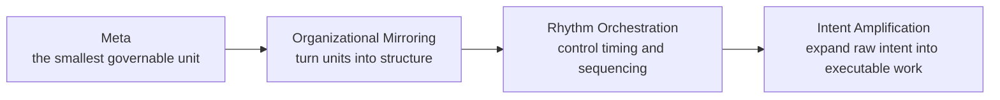
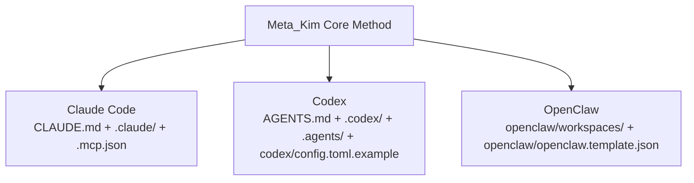

# Meta_Kim

[English](README.md) | [简体中文](README.zh-CN.md)


<div align="center">

**An open-source meta-architecture for intent amplification across Claude Code, Codex, and OpenClaw**

Meta_Kim is not a prompt dump. It is a cross-runtime operating system for organizing complex work through meta units, organizational mirroring, rhythm orchestration, and intent amplification.

</div>

## What This Project Is

Meta_Kim exists for one reason:

**to make the same intent-amplification discipline hold across multiple AI runtimes, instead of collapsing into one-off lucky outputs.**

The project treats user requests as raw intent, not finished tasks.  
Before execution, the system should:

- identify the real objective
- surface missing constraints
- choose the right structure
- decide what should happen now, later, or not at all
- produce a task shape that is actually executable

So this repository is not:

- a chatbot product
- a website or SaaS
- a single giant prompt
- a random pile of agent files

It is an architecture pack that combines:

- agents
- skills
- MCP integrations
- hooks
- memory strategy
- workspace layouts
- runtime sync scripts
- validation and evaluation tooling

## The Four-Part Method

Meta_Kim is built around one chain:

**Meta -> Organizational Mirroring -> Rhythm Orchestration -> Intent Amplification**



Each layer solves a different problem:

- `Meta` solves decomposition
- `Organizational Mirroring` solves structure
- `Rhythm Orchestration` solves timing
- `Intent Amplification` solves completion

If one layer is missing, the method is incomplete.

## What “Meta” Means Here

In Meta_Kim, a meta unit is:

**the smallest governable unit that exists to support intent amplification.**

It is not just a small component. It must be:

- independent enough to reason about on its own
- small enough to stay controllable
- bounded enough to know what it does not own
- replaceable without collapsing the whole system
- reusable across workflows

This is why Meta_Kim uses the word `meta` as an architectural term, not as decoration.

## Why This Matters

A common failure mode in AI work is mistaking a single successful output for a stable system.

Meta_Kim rejects that.

A mature system needs a governance loop. In this project, that loop is framed through a ten-step operating discipline:

1. Direction
2. Planning
3. Execution
4. Review
5. Meta-review
6. Revision
7. Verification
8. Synthesis
9. Feedback
10. Evolution

The goal is not to look smart once. The goal is to become repeatable, auditable, and improvable.

## How It Lands in Three Runtimes

Meta_Kim does not force Claude Code, Codex, and OpenClaw to look identical.

It enforces one underlying operating logic while letting each runtime keep its native interface.



| Runtime | User-facing entry | Main repo surface | Purpose |
| --- | --- | --- | --- |
| Claude Code | `CLAUDE.md` | `.claude/`, `.mcp.json` | Primary editing runtime and canonical source for meta agents and skills |
| Codex | `AGENTS.md` | `.codex/`, `.agents/`, `codex/config.toml.example` | Codex-native agent and skill projection from the same source |
| OpenClaw | `openclaw/workspaces/` | `openclaw/` | Local workspace agents that preserve the same governance logic |

The outer shell can differ.  
The core discipline cannot.

## The Eight Meta Agents

These are not menu items. They are the current organizational backbone.

- `meta-warden`: default entry, arbitration, final synthesis
- `meta-conductor`: orchestration, sequencing, rhythm control
- `meta-genesis`: prompt identity, persona, `SOUL.md`
- `meta-artisan`: skills, MCP, tool fit, capability design
- `meta-sentinel`: hooks, safety, permissions, rollback
- `meta-librarian`: memory, knowledge continuity, context policy
- `meta-prism`: quality review, drift detection, anti-slop enforcement
- `meta-scout`: external tool discovery and evaluation

The default user-facing interpretation should be:

**`meta-warden` is the front door. The other seven are backstage structure.**

## Agent Foundry

The next production layer in this repository is a **published industry library**, not a pile of temporary build folders.

The release now exposes:

- **20 industries**
- **5 departments per industry**
- **100 department agents**
- **1000 specialist agents**
- **1100 runtime import packs**
- **20 hand-polished flagship agents**

The final public surfaces are:

- [`factory/README.md`](factory/README.md)
- [`factory/README.zh-CN.md`](factory/README.zh-CN.md)
- [`factory/industry-coverage-matrix.md`](factory/industry-coverage-matrix.md)
- [`factory/flagship-20.md`](factory/flagship-20.md)
- [`factory/agent-library/`](factory/agent-library)
- [`factory/flagship-complete/README.md`](factory/flagship-complete/README.md)
- [`factory/flagship-complete/README.zh-CN.md`](factory/flagship-complete/README.zh-CN.md)
- [`factory/runtime-packs/README.md`](factory/runtime-packs/README.md)
- [`factory/runtime-packs/README.zh-CN.md`](factory/runtime-packs/README.zh-CN.md)

Read it this way:

- `factory/agent-library/` is the full human-readable 100/1000 library
- `factory/runtime-packs/` is the full machine-facing 1100-agent import surface
- `factory/flagship-complete/` is the curated 20-agent polished layer

## Public vs Private Research

The long-form local research manuscript under `meta/` is intentionally not part of the public GitHub payload.

This public repository ships the runtime-facing architecture and production tooling.  
Private research notes stay local.

## Repository Map

```text
Meta_Kim/
├─ .claude/        Canonical Claude Code source: agents, skills, hooks, settings
├─ .codex/         Codex-native agents and skills generated from the Claude source
├─ .agents/        Codex project-level skill mirror
├─ codex/          Global Codex config example, not a second runtime
├─ openclaw/       OpenClaw workspaces, templates, and runtime mirrors
├─ factory/        Published foundry release: agent library, flagship bundle, runtime packs
├─ scripts/        Sync, validation, MCP, evaluation, and local runtime helper scripts
├─ shared-skills/  Shared skill mirrors across runtimes
├─ AGENTS.md       Codex and cross-runtime orientation
├─ CLAUDE.md       Claude Code orientation
├─ .mcp.json       Claude Code project MCP entry
├─ README.md       English primary README
└─ README.zh-CN.md Chinese README
```

## Why There Is a `codex/` Folder

This confuses people the most.

Codex consumes two kinds of configuration:

- repo-local assets, which live in `.codex/` and `.agents/`
- user-global configuration, which cannot live directly inside the repo

So:

- `.codex/` is what Codex reads inside the repository
- `codex/` is only an example directory showing how to wire `~/.codex/config.toml`

It is not duplication. It is a consequence of Codex's config model.

## Human-Friendly Command Guide

Not every reader needs to run every command.

### `npm install`

Use this when:

- you just cloned the repo
- you want to validate or generate assets locally

Skip this when:

- you are only reading docs

### `npm run sync:runtimes`

Use this when:

- you changed canonical agents or skills
- you changed runtime-facing configuration
- you want Claude Code, Codex, and OpenClaw mirrors regenerated

Think of it as: **rebuild the runtime projections**.

### `npm run prepare:openclaw-local`

Use this only when:

- you actually want to run the OpenClaw side on your own machine

This command prepares local OpenClaw auth/state wiring that cannot live purely inside the repo.

### `npm run verify:all`

Use this when:

- you are about to publish
- you changed runtime assets and want a full acceptance pass
- you want one command that runs the repo check plus runtime evaluation

## Simplest Way to Start

If you are just reading the project:

- read `README.md`
- read `CLAUDE.md`
- read `AGENTS.md`
- inspect `.claude/agents/`

If you want to verify the repo is real and not a shell:

```bash
npm install
npm run sync:runtimes
npm run verify:all
```

If you also want to run OpenClaw locally:

```bash
npm run prepare:openclaw-local
```

If you want to inspect the finished industry layer:

- read `factory/industry-coverage-matrix.md`
- inspect `factory/agent-library/`
- inspect `factory/flagship-complete/`
- inspect `factory/runtime-packs/`

## Paper and Method Basis

The methodological basis for this repository comes from the author's evaluation work on meta-based intent amplification.

- Paper: <https://zenodo.org/records/18957649>
- DOI: `10.5281/zenodo.18957649`

The paper explains:

- why meta units matter
- why structure matters more than isolated model brilliance
- why organizational mirroring and rhythm orchestration are necessary layers
- why intent amplification is a result layer, not a starting slogan

This repository explains:

- how to turn that method into runtime-ready engineering assets

## Author and Contact

<div align="center">
  
  <p><strong>For updates, discussion, and longer-term project follow-up</strong></p>
  <p>
    🌐 <a href="https://www.aiking.dev/">aiking.dev</a> |
    GitHub <a href="https://github.com/KimYx0207">KimYx0207</a> |
    𝕏 <a href="https://x.com/KimYx0207">@KimYx0207</a> |
    WeChat Official Account: <strong>老金带你玩AI</strong>
  </p>
  <p>
    Open knowledge base:
    <a href="https://my.feishu.cn/wiki/OhQ8wqntFihcI1kWVDlcNdpznFf">Feishu knowledge base</a>
  </p>
</div>

## Support the Author

<div align="center">
  <p><strong>If this method, repository structure, or documentation helps you, support is welcome.</strong></p>
  <table align="center">
    <tr>
      <td align="center">
        
        <br/>
        <strong>WeChat Pay</strong>
      </td>
      <td align="center">
        
        <br/>
        <strong>Alipay</strong>
      </td>
    </tr>
  </table>
</div>

## License

This project is released under [CC BY 4.0](https://creativecommons.org/licenses/by/4.0/).

You may share and adapt it, as long as attribution is preserved and changes are clearly marked.
